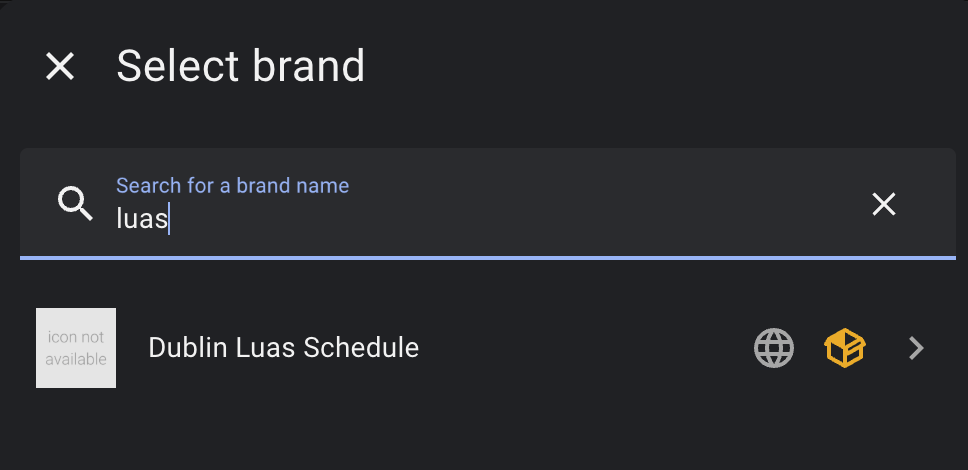
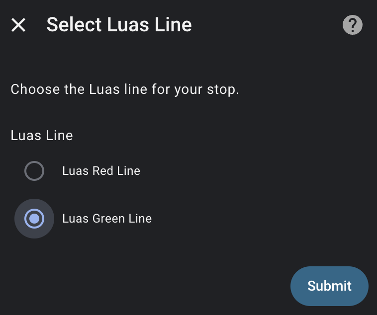
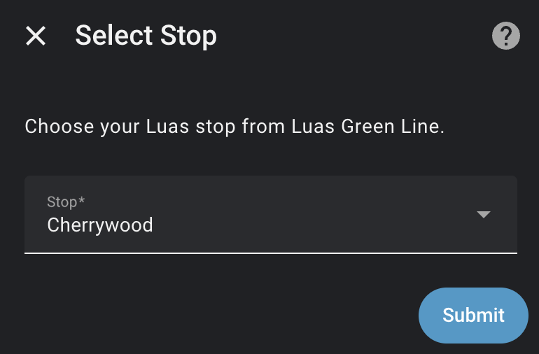

# Dublin Luas Schedule

[](https://github.com/hacs/integration)
[](https://github.com/william88987/dublin-luas-schedule-hacs/releases)

A Home Assistant custom integration for displaying real-time Dublin Luas tram schedules.

## Features

- 🚃 Real-time tram arrival information for all 67 Luas stops
- 🔄 Automatic updates every 60 seconds
- 📱 CarPlay support via Home Assistant Companion app
- 🎨 Easy dashboard integration with markdown templates
- ✨ Simple UI-based configuration - no YAML required

## Installation

### HACS (Recommended)

1. Open HACS in Home Assistant
2. Click the three dots in the top right corner
3. Select "Custom repositories"
4. Add `https://github.com/william88987/dublin-luas-schedule-hacs` with category "Integration"
5. Search for "Dublin Luas Schedule"
6. Click "Download"
7. Restart Home Assistant

### Manual Installation

1. Download the latest release from GitHub
2. Copy the `custom_components/dublin_luas_schedule` folder to your `config/custom_components/` directory
3. Restart Home Assistant

## Configuration

1. Go to **Settings** → **Devices & Services**
2. Click **+ Add Integration**
3. Search for "Dublin Luas Schedule"

   

4. Select your Luas line (Red or Green)

   

5. Select your stop

   

6. Done! Sensors will be created automatically

You can add multiple stops by repeating the configuration process.

## Sensors

For each configured stop, the following sensors are created:

| Sensor | Description | Example State |
|--------|-------------|---------------|
| `sensor.luas_<stop>_inbound_next` | Next inbound tram | "DUE" or "5 min" |
| `sensor.luas_<stop>_outbound_next` | Next outbound tram | "12 min" |
| `sensor.luas_<stop>_status` | Service status message | "Green Line services operating normally" |

### Sensor Attributes

The inbound/outbound sensors include these attributes:

- `destination` - Where the next tram is going
- `arrival_time` - Exact arrival time in HH:MM format
- `all_trams` - List of all upcoming trams (for templating)
- `stop_name` - Human-readable stop name
- `stop_code` - Stop abbreviation code
- `message` - Service status message

Each tram in `all_trams` includes:
- `destination` - Final destination
- `due` - "DUE" or "X min"
- `arrival_time` - Exact time (e.g., "19:45")

## Dashboard Templates

### Markdown Card - Full Schedule

```yaml
type: markdown
title: 🚃 Luas - Cherrywood
content: |
  **{{ states('sensor.cherrywood_status') }}**
  
  ### ⬆️ Inbound
  
  
  
  - **{{ tram.destination }}**: {{ tram.due }} ({{ tram.arrival_time }})
  
  
  No trams scheduled
  
  
  ### ⬇️ Outbound
  
  
  
  - **{{ tram.destination }}**: {{ tram.due }} ({{ tram.arrival_time }})
  
  
  No trams scheduled
  
```

### Markdown Card - Compact View

```yaml
type: markdown
title: Luas
content: |
  🚃 **Cherrywood**
  ⬆️ {{ state_attr('sensor.cherrywood_inbound_next', 'arrival_time') }} → {{ state_attr('sensor.cherrywood_inbound_next', 'destination') }}
  ⬇️ {{ state_attr('sensor.cherrywood_outbound_next', 'arrival_time') }} → {{ state_attr('sensor.cherrywood_outbound_next', 'destination') }}
```

### Entities Card

```yaml
type: entities
title: Luas Schedule
entities:
  - entity: sensor.cherrywood_inbound_next
    name: Inbound
    icon: mdi:tram
  - entity: sensor.cherrywood_outbound_next
    name: Outbound
    icon: mdi:tram-side
  - entity: sensor.cherrywood_status
    name: Status
```

## Custom Luas Schedule Card

This integration includes a custom Lovelace card with configurable views.

### Adding the Card Resource

When installed via HACS, the card file and resource are **registered automatically**.

The card is available at: `/hacsfiles/dublin_luas_schedule/luas-schedule-card.js`

> **Note**: If the card doesn't appear, go to **Settings** → **Dashboards** → **Resources** and verify the resource is listed. If not, add it manually with the URL above.

### Using the Card

Add the card to your dashboard via the UI editor - search for "Luas Schedule Card" in the card picker.

Or manually add YAML:

```yaml
type: custom:luas-schedule-card
entity: sensor.cherrywood_inbound_next
view_type: full       # 'full' or 'compact'
max_trams: 5          # 1-10
show_inbound: true
show_outbound: true
```

### Configuration Options

| Option | Default | Description |
|--------|---------|-------------|
| `entity` | Required | Any Luas sensor for the stop (inbound, outbound, or status) |
| `view_type` | `full` | `full` shows arrival times, `compact` shows only due time |
| `max_trams` | `5` | Maximum number of trams to display per direction (1-10) |
| `show_inbound` | `true` | Show inbound trams section |
| `show_outbound` | `true` | Show outbound trams section |

### Card Features

- **Full Schedule View**: Shows destination, due time, and exact arrival time
- **Compact View**: Condensed display with just destination and due time
- **Visual Card Editor**: Configure all options through the UI
- **Auto-updates**: Refreshes with your sensor data every 60 seconds
- **Dark Mode Support**: Automatically adapts to your Home Assistant theme

## CarPlay Support

The Home Assistant Companion app (iOS 2024.1+) supports CarPlay. To add Luas schedule to CarPlay:

1. Open the Home Assistant Companion app on your iPhone
2. Go to **Settings** → **Companion App** → **CarPlay**
3. Tap **Quick Access**
4. Add your Luas sensors (e.g., `sensor.cherrywood_inbound_next`)
5. The sensor will now appear in CarPlay showing the next tram time

### Tips for CarPlay
- Add the "next" sensors for quick glance at arrival times
- The sensor state shows "DUE" or "X min" which is perfect for CarPlay's compact display
- Tap a sensor in CarPlay to see more details

## Luas Stops

### Red Line (32 stops)
The Point, Spencer Dock, Mayor Square - NCI, George's Dock, Connolly, Busáras, Abbey Street, Jervis, Four Courts, Smithfield, Museum, Heuston, James's, Fatima, Rialto, Suir Road, Goldenbridge, Drimnagh, Blackhorse, Bluebell, Kylemore, Red Cow, Kingswood, Belgard, Cookstown, Hospital, Tallaght, Fettercairn, Cheeverstown, Citywest Campus, Fortunestown, Saggart

### Green Line (35 stops)
Broombridge, Cabra, Phibsborough, Grangegorman, Broadstone - University, Dominick, Parnell, O'Connell - Upper, O'Connell - GPO, Marlborough, Westmoreland, Trinity, Dawson, St. Stephen's Green, Harcourt, Charlemont, Ranelagh, Beechwood, Cowper, Milltown, Windy Arbour, Dundrum, Balally, Kilmacud, Stillorgan, Sandyford, Central Park, Glencairn, The Gallops, Leopardstown Valley, Ballyogan Wood, Carrickmines, Laughanstown, Cherrywood, Brides Glen

## Troubleshooting

### Sensors show "Unknown" or "Unavailable"
- Check your internet connection
- The Luas API may be temporarily unavailable
- Check Home Assistant logs for error messages

### No trams showing
- This is normal during off-hours when no trams are running
- Check the service status sensor for any disruption messages

## Credits

- Data provided by [Transport Infrastructure Ireland](https://www.luas.ie/)
- API: `http://luasforecasts.rpa.ie/xml/get.ashx`

## License

MIT License - see [LICENSE](LICENSE) for details.
